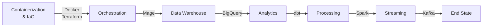
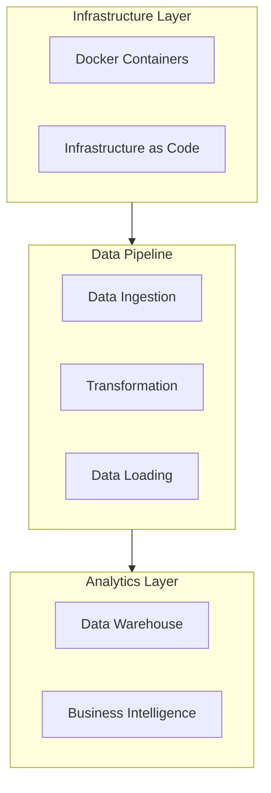

# Data Engineering Zoomcamp 2025 - Homework Repository

This repository contains homework submissions for the [Data Engineering Zoomcamp 2025](https://github.com/DataTalksClub/data-engineering-zoomcamp) course by DataTalks.Club.

## Project Overview

A comprehensive exploration of modern data engineering practices, integrating enterprise-grade tools and methodologies:



## Module Structure

Each module demonstrates the practical application of data engineering principles in an enterprise context:

- `module1/`: Docker, Terraform, and Infrastructure as Code
  - Container orchestration
  - Infrastructure automation
  - Local and cloud deployment patterns

Future modules will include:
- Workflow Orchestration with Mage
- Data Warehouse Implementation
- Analytics Engineering with dbt
- Batch Processing with Spark
- Stream Processing with Kafka

## Architecture Highlights

- **Modular Design**: Each component is containerized and independently scalable
- **Infrastructure as Code**: Automated deployment and configuration
- **Data Governance**: Implemented through clear documentation and version control
- **Enterprise Integration**: Focus on maintainable, production-ready solutions

## Technical Implementation

Key aspects of the implementation:



## Getting Started

1. Clone the repository:
```bash
git clone https://github.com/jschuller/dezoomcamp-2025-hw.git
```

2. Each module contains:
   - Detailed documentation
   - Implementation code
   - Infrastructure configurations
   - Test cases and examples

## Acknowledgments

This work is based on the excellent curriculum provided by [DataTalks.Club](https://datatalks.club/). The original course material can be found [here](https://github.com/DataTalksClub/data-engineering-zoomcamp).
