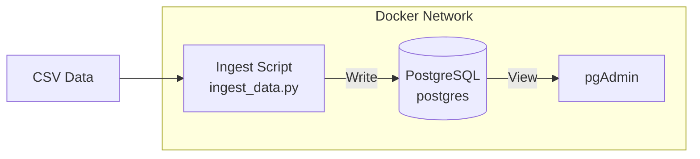
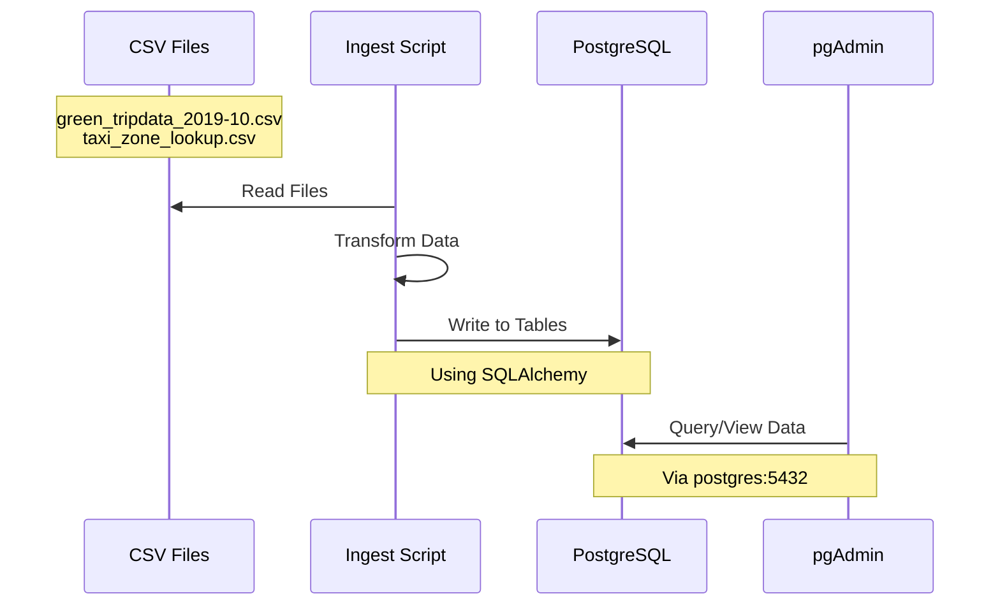
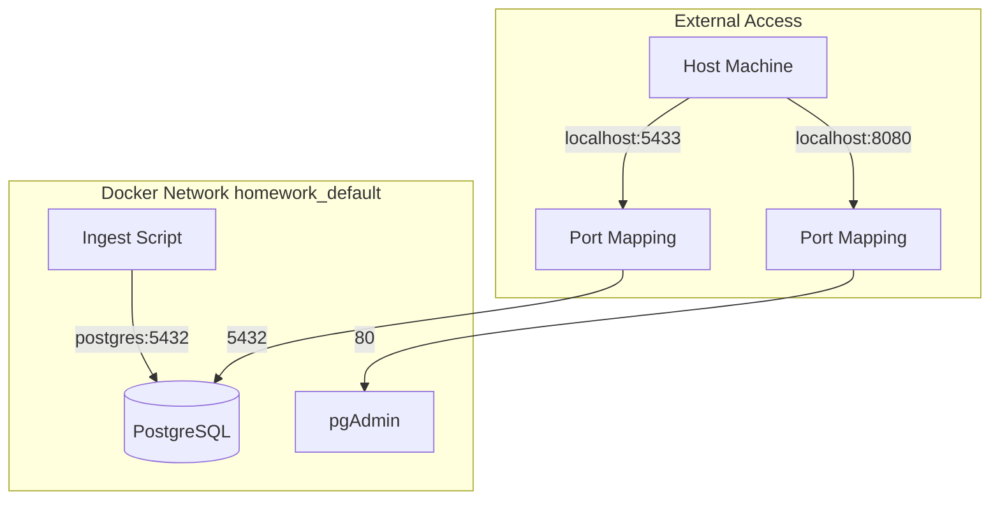
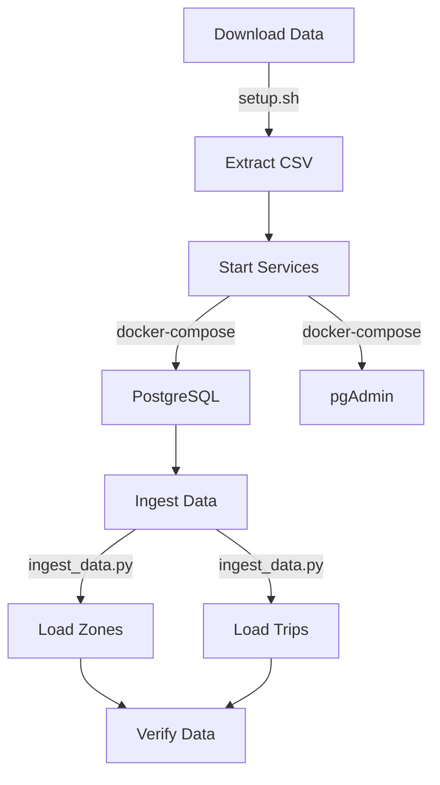
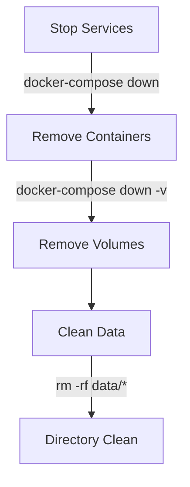

# NYC Taxi Data Pipeline

## Architecture



## Quick Start

1. Download data files:
```bash
chmod +x setup.sh
./setup.sh
```

2. Start database services:
```bash
docker-compose up -d
```

3. Run data ingestion:
```bash
python ingest_data.py
```

## Data Flow



## Infrastructure Configuration



## Directory Structure
```
.
├── data/                      # Downloaded data files
│   ├── green_tripdata_2019-10.csv
│   └── taxi_zone_lookup.csv
├── docker-compose.yaml        # Database services config
├── setup.sh                   # Data download script
├── ingest_data.py            # Data ingestion script
└── test_queries.sql          # SQL queries for homework
```

## Service Configuration

### Database Access
- Host: localhost (external) or postgres (internal)
- Port: 5433 (external) or 5432 (internal)
- Database: ny_taxi
- Username: postgres
- Password: postgres

### pgAdmin Access
- URL: http://localhost:8080
- Email: pgadmin@pgadmin.com
- Password: pgadmin
- Server configuration:
  - Host: postgres
  - Port: 5432
  - Database: ny_taxi
  - Username: postgres
  - Password: postgres

## Data Pipeline Process



## Common Issues

### Connection Issues
1. Check containers:
```bash
docker-compose ps
```

2. View logs:
```bash
docker-compose logs
```

### Data Loading Problems
1. Verify files:
```bash
ls -l data/
```

2. Check space:
```bash
df -h
```

## Cleanup



### Full Cleanup
```bash
# Stop and remove containers
docker-compose down

# Remove volumes
docker-compose down -v

# Clean data directory
rm -rf data/*
```

## Useful Commands

### Container Management
```bash
# Check container status
docker-compose ps

# View container logs
docker-compose logs

# Restart services
docker-compose restart
```

### Database Access
```bash
# Connect using pgcli
pgcli -h localhost -p 5433 -U postgres -d ny_taxi

# Run test queries
pgcli -h localhost -p 5433 -U postgres -d ny_taxi -f test_queries.sql
```